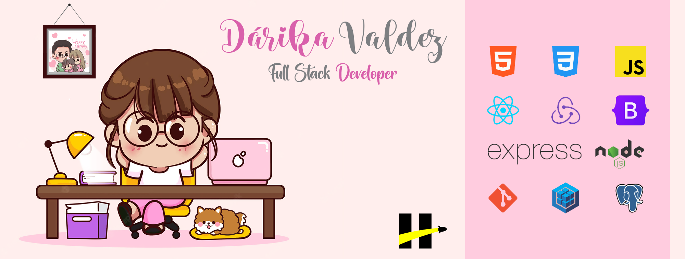

 # Hola!
 ### Soy Dárika Valdez (Full Stack Developer) me encanta el mundo de la programación sobretodo el Front End!!

<h4 align="left"><b><i>Encuentrame en:</i></b></h3>

 
 <b><i> Mi perfil en LinkedIn</i></b>

 
 <b><i> Mi portafolio</i></b>

<h3 align="center">Tecnologías que utilizo:</h3>

    
    
    
    
    
    
    
    
    
    
    
    
    
    

 
y muchas más por aprender!

   
 
 ## Proyectos:
-Dogs App  --> Full stack app que consume una API para mostrar y crear nuevas recetas! [Click here!](https://github.com/Darikita/PI-DOGS-FINAL)
-HenryFilms  --> Front end! E-comerce de series y peliculas [Click here!](https://github.com/franxdd/henryfilm)
